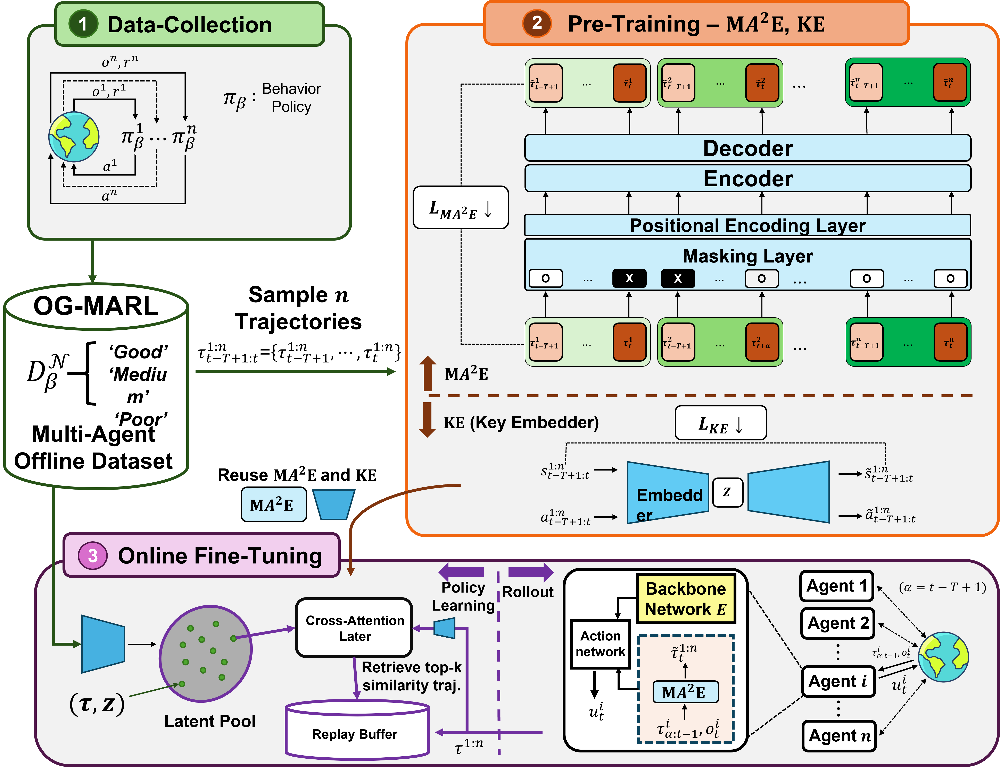
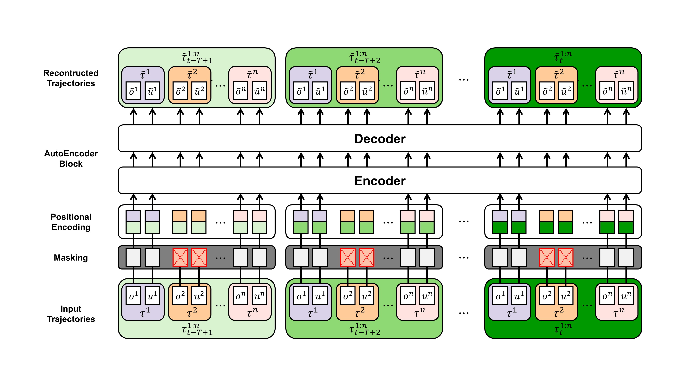
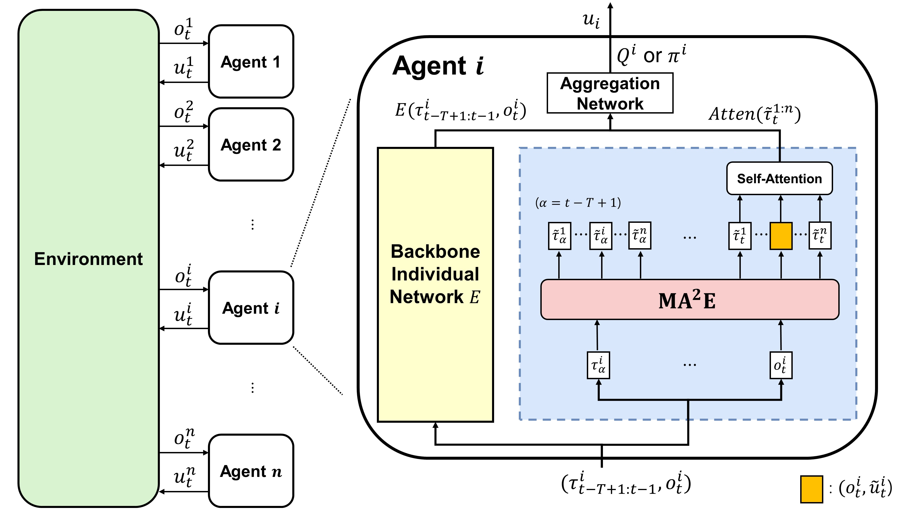

# BOOM : Bridging Offline Data to Online Learning in Multi-Agent Reinforcement Learning with Self-Supervised Pretraining

  
  

## 🎯 Description 
This is a code repository for The Final Project in SNU RL for Data Science.

## ⚙️ Installation
The code is based on pymarl2. 
For detailed information, refere to the installation instructions of [pymarl2](https://github.com/hijkzzz/pymarl2) and [SMAC](https://github.com/oxwhirl/smac).

1️⃣ Cloning MA2E 

`git clone https://github.com/One-star11/MA2E.git`

2️⃣ Donwload and setup StarCraftII 

`bash install_sc2.sh`

3️⃣ Install required packages 

`pip install -r requirements.txt`

## 🎮 Running Script

🏃Run an experiment 

`bash run.sh config_name env_config_name map_name_list (arg_list threads_num gpu_list experinments_num)`

✔️ Example 

`bash run.sh qmix sc2 3s_vs_5z use_MT=True 3 0 3`

* Run QMIX+MA2E in SMAC 3s_vs_5z scenario
  
* `use_MT` means executing the model plugs in MA2E into the baseline algorithm. 
